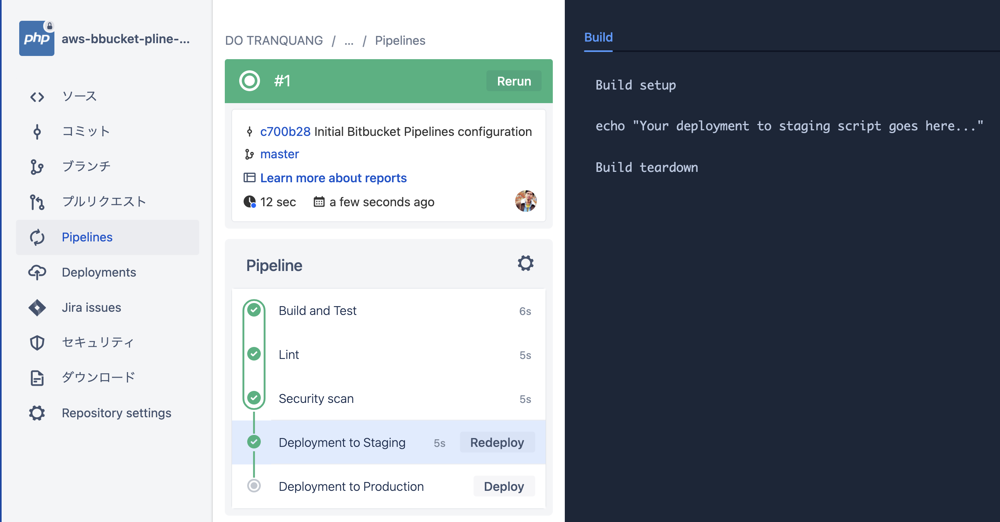
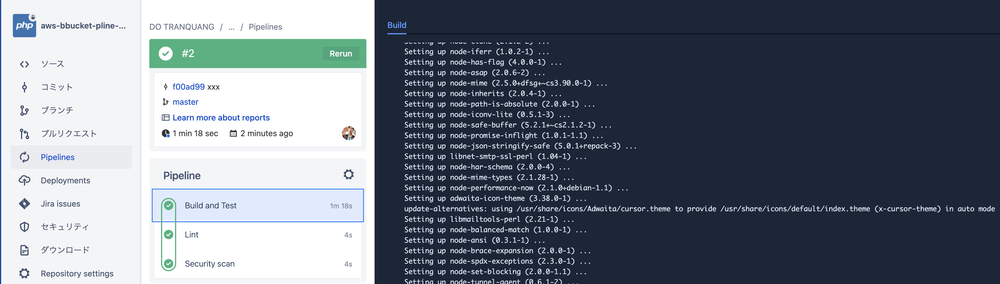
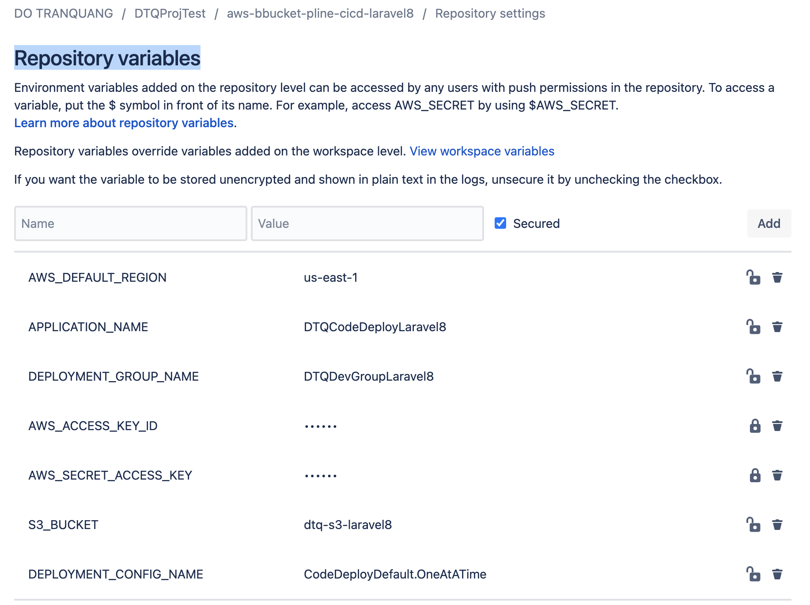
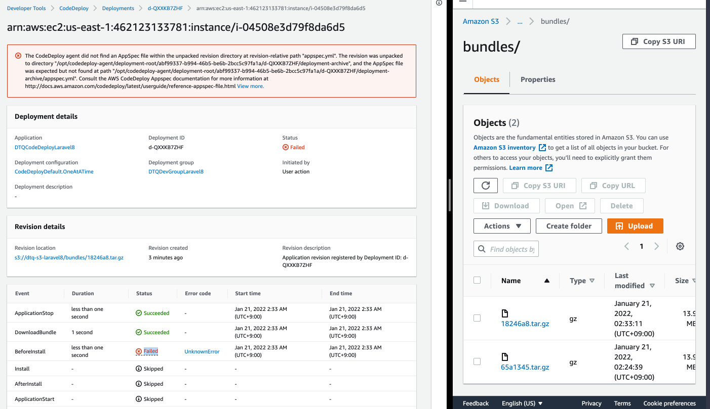
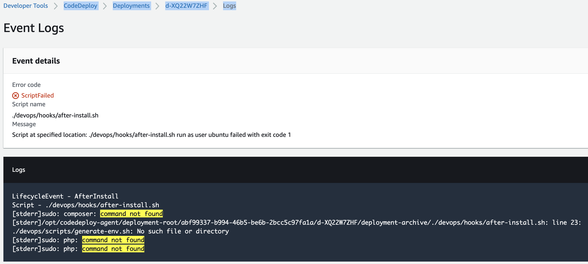
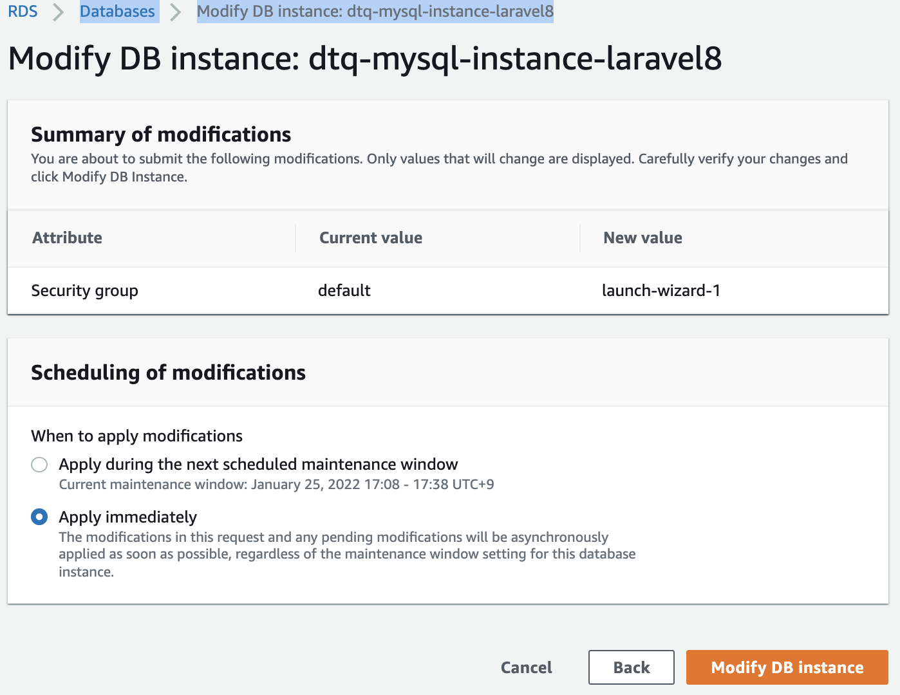
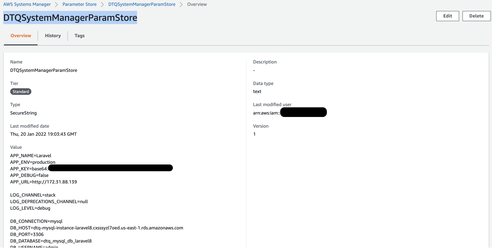
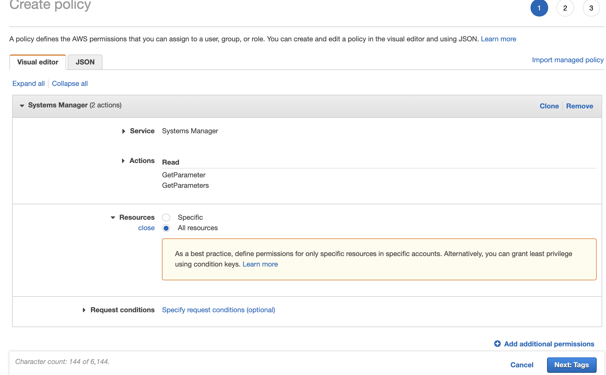
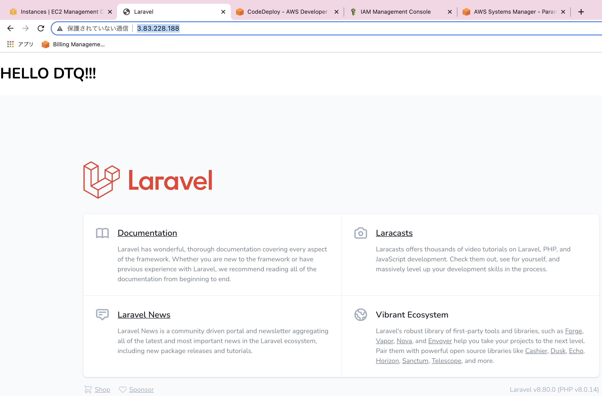

# aws-bbucket-pline-cicd-laravel8 🐳


[](https://github.com/tquangdo/aws-bbucket-pline-cicd-laravel8/issues/new)

## reference
[youtube](https://www.youtube.com/watch?v=YQsHMbbcIBo)

## [Bitbucket] Create Repository
- create project name=`aws-bbucket-pline-cicd-laravel8`
- `composer create-project laravel/laravel aws-bbucket-pline-cicd-laravel8`
```shell
git init
git add .
git commit -m 'add Laravel proj'
git remote add origin https://dotranquang@bitbucket.org/dotranquang/aws-bbucket-pline-cicd-laravel8.git
git branch -vv
git push -u -f origin master
```
## [Bitbucket] Create Pipeline
- create `aws-bbucket-pline-cicd-laravel8/bitbucket-pipelines.yml`(by default)


## [Bitbucket] Pipeline - Build Server
- `bitbucket-pipelines.yml` > edit:
```yaml
image: php:8.0-fpm
...
script:
  - bash ./devops/build-server.sh
```
- create `devops/build-server.sh`
```shell
git add .
git commit -m 'xxx'
git push
```


## [Bitbucket] Pipeline - Build Laravel Project
- `bitbucket-pipelines.yml` > edit:
```yaml
services:
    - mysql
    ...
    - bash ./devops/build-project.sh
```
- create `.env.pipelines`
- create `devops/build-project.sh`
```shell
...
git push
```

## [Bitbucket] Automated Testing
- `bitbucket-pipelines.yml` > edit:
```yaml
    - bash ./devops/run-tests.sh
```
- create `devops/run-tests.sh`
```shell
...
git push
```

## [AWS IAM] Create Service Role - For EC2 Instance
- create rolename=`DTQRoleLaravel8`
- policies=`AWSCodeDeployFullAccess` & `AmazonS3FullAccess`

## [AWS S3] Create S3 Bucket
- create bucketname=`dtq-s3-laravel8`

## [AWS EC2] Create EC2 Instance
- AMI=`Ubuntu Server 20.04`
- IAM role=`DTQRoleLaravel8`
- SG=
```json
"ssh": MyIP,
"http": all,
"https": all,
```
- tags key=`CodeDeploy`

## [AWS RDS] Create RDS - MySQL Server
- method=`standard create`
- engine type=`MySQL`
- Templates=`Free tier`
- instance=`dtq-mysql-instance-laravel8`
- Master username=`admin` & PW=`xxx`
- DB instance class=`Burstable classes (includes t classes)`
- Storage type=`General Purpose...`
- uncheck `Enable storage autoscaling`

## [AWS EC2] Install CodeDeploy Agent
- ssh to EC2
```shell
sudo apt update
sudo apt install ruby-full wget
wget https://aws-codedeploy-us-east-1.s3.us-east-1.amazonaws.com/latest/install
chmod +x ./install
sudo ./install auto > /tmp/logfile
sudo service codedeploy-agent status
-> will see "active (running)"
```

## [AWS CodeDeploy] Create Application
- app name=`DTQCodeDeployLaravel8`
- Compute platform=`EC2/On-premises`
### [AWS IAM] Create Service Role
- create rolename=`DTQRoleCodeDeployLaravel8`
- policies=`AWSCodeDeployRole`
### [AWS CodeDeploy] Create Deployment Group
- groupname=`DTQDevGroupLaravel8`
- rolename=`DTQRoleCodeDeployLaravel8`
- Deployment type=`In-place`
- Environment configuration=`EC2`
- tag key=`CodeDeploy` (=EC2 tags key)
- Deployment configuration=`CodeDeployDefault.AllAtOnce`
- uncheck `Enable load balancing`

## [Bitbucket] Pipeline - Add Environment Vars
- Repo settings > Repository variables


## [Bitbucket] Pipeline - Deploy to Production #1
- create `bundle.conf`
- `bitbucket-pipelines.yml` > edit:
```yaml
image: php:8.0-fpm
...
script:
  - bash ./devops/build-for-production.sh
  - bash ./devops/deploy-production.sh
```
- create `devops/build-for-production.sh` & `devops/deploy-production.sh`
```shell
...
git push
```
- see in AWS codedeploy & S3 will see this result:

- ssh to EC2:
```shell
ubuntu@ip-172-31-88-139:~$ ll /opt/codedeploy-agent/deployment-root/abf99337-b994-46b5-be6b-2bcc5c97fa1a/d-
d-K5YINRZHF/ d-QXXKB7ZHF/ 
ubuntu@ip-172-31-88-139:~$ ls /opt/codedeploy-agent/deployment-root/abf99337-b994-46b5-be6b-2bcc5c97fa1a/d-QXXKB7ZHF/deployment-archive/
app      bootstrap      composer.lock  database  node_modules  public     routes      storage
artisan  composer.json  config         devops    package.json  resources  server.php  webpack.mix.js
```

## [Bitbucket] Pipeline - appspec.yml
- create `appspec.yml`
- create `devops/hooks/after-install.sh`
```shell
...
git push
```
- see ERR like this:


## [AWS EC2] Configure Production Server
- ssh to EC2 & create `devops/scripts/build-production-server.sh`
```shell
vim build-production-server.sh
chmod +x build-production-server.sh
./build-production-server.sh
```
- do the same with `devops/scripts/configure-apache.sh`
- check:
```shell
ls /var/www/aws-codedeploy-bitbucket-laravel/
app          artisan    composer.json  config    devops        package.json  resources  server.php  webpack.mix.js
appspec.yml  bootstrap  composer.lock  database  node_modules  public        routes     storage
```
- install `mysql`
```shell
sudo apt install mysql-client-core-8.0
```
- `ip a` and get ECS's IP=`172.31.88.139` (same with AWS EC2 > `Private IPv4 addresses`)
- AWS SG > Inbound rules > MySQL/Aurora & `172.31.88.139/32`
- AWS RDS SG > change FROM `default` TO `EC2's SG`

- connect mysql
```shell
mysql -h dtq-mysql-instance-laravel8.cxsssyzl7oed.us-east-1.rds.amazonaws.com -u admin -p
Enter password: 
Welcome to the MySQL monitor.  Commands end with ; or \g.
Your MySQL connection id is 43
Server version: 8.0.23 Source distribution

mysql> create database dtq_mysql_db_laravel8;
Query OK, 1 row affected (0.00 sec)
mysql> show databases;
+-----------------------+
| Database              |
+-----------------------+
| dtq_mysql_db_laravel8 |
| information_schema    |
| mysql                 |
| performance_schema    |
| sys                   |
+-----------------------+
```

## [AWS EC2] Systems Manager
- parameter store > `create parameter`
- name=`DTQSystemManagerParamStore`
- value=`.env`
```json
APP_NAME=Laravel
APP_ENV=production
APP_KEY=base64:xxx
APP_DEBUG=false
APP_URL=http://172.31.88.139
...
DB_CONNECTION=mysql
DB_HOST=dtq-mysql-instance-laravel8.cxsssyzl7oed.us-east-1.rds.amazonaws.com
DB_PORT=3306
DB_DATABASE=dtq_mysql_db_laravel8
DB_USERNAME=admin
DB_PASSWORD=xxx
```

- create policy `DTQPolicyLaravel8` for role=`DTQRoleLaravel8`

- create `devops/scripts/generate-env.sh`
- edit `resources/views/welcome.blade.php > <h1>HELLO DTQ!!!</h1>`
```shell
...
git push
```
- `devops/scripts/generate-env.sh` & `devops/hooks/after-install.sh` have ERR, so need ssh to EC2 and fix manual
```shell
composer install
sudo apt-get install php-mysql
vim /etc/php/8.0/apache2/php.ini # delete cmt out of `extension=pdo_mysql`
sudo /etc/init.d/apache2 restart
php artisan config:clear
hp artisan key:generate
php artisan migrate
```
- see final res:


---

## reference of *.sh
**[./devops/hooks/after-install.sh](./devops/hooks/after-install.sh)**
Once CodeDeploy agent is installed onto your server and a deploy action
is triggered; CodeDeploy triggers hooks  that allow you to run scripts on your
server during certain events. Supported events are: ** ApplicationStop, DownloadBundle, BeforeInstall, Install, AfterInstall,
ApplicationStart, ValidateService.** Used inside inside [./appspec.yml](./bitbucket-pipelines.yml). This script
runs inside our server after our application is installed. We change user owner to ubuntu & fix storage permission issues,
run composer install and load our env file from [AWS Systems Manager](https://aws.amazon.com/systems-manager/).

**[devops/scripts/generate-env.sh](./devops/scripts/generate-env.sh)**
Runs inside [bitbucket-pipelines.yml](./bitbucket-pipelines.yml). Creates a tar bundle for our project and stores it in AWS S3 Bucket. Then creates a new deployment using AWS CodeDeploy. The files are listed inside the [bundle.conf](./bundle.conf) file.

**[devops/build-for-production.sh](./devops/build-for-production.sh)**
Used inside [bitbucket-pipelines.yml](./bitbucket-pipelines.yml). Builds Laravel App for production. Different than testing.

**[devops/build-project.sh](./devops/build-project.sh)**
Used inside Bitbucket pipelines. Builds Laravel project and prepares it for testing. Creates an .env file from [.env.pipelines](./.env.pipelines).

**[devops/build-server.sh](./devops/build-server.sh)**
Used inside [bitbucket-pipelines.yml](./bitbucket-pipelines.yml). Builds server for testing stage.

**[devops/deploy-production.sh](./devops/deploy-production.sh)**
Used inside [bitbucket-pipelines.yml](./bitbucket-pipelines.yml). Creates a tar bundle for our project and stores it in AWS S3 Bucket. Then creates a new deployment using AWS CodeDeploy. The files are listed inside the bundle.conf file.

**[devops/run-tests.sh](./devops/run-tests.sh)**

**[.env.pipelines](./.env.pipelines)**
Runs inside your production server on new deployment. loads your .env file stored inside AWS Systems Manager (Paramater).

**[bitbucket-pipelines.yml](./bitbucket-pipelines.yml)**
Runs inside Bitbucket. Triggers Bitbucket pipelines per your specification.

**[appspec.yml](./appspec.yml)**
Runs inside your production server on deployment. Add this to give CodeDeploy instructions.

**[bundle.conf](./bundle.conf)**
Lists all files or directories that you want to include in the bundle.tar file that we will create and and store inside S3. Used for deployment..

**[devops/scripts/build-production-server.sh](./devops/scripts/build-production-server.sh)**
Not used anywhere. Just helps install all what you need on your production server to run a basic laravel project. Run manually.

**[devops/scripts/configure-apache.sh](./devops/scripts/configure-apache.sh)**
Not used anywhere. Just helps you set up apache2 conf, disable default site and enable new site. Change variables.

